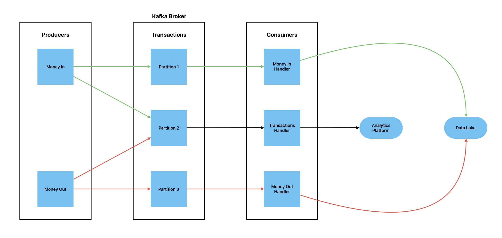

# node-js-kafka
This is a beginner friendly repository that demonstrates how to set up a kafka cluster using [bitnami kafka image](https://hub.docker.com/r/bitnami/kafka), producers, and consumers thru [KafkaJS](http://kafka.js.org) on top of [NodeJS](http://kafka.js.org).

## 🧱 System Architecture


## 💡 General Idea
To initiate Kafka, you'll require three essential components for the entire process to function seamlessly: a Kafka server, an operational application responsible for data production, and a consumer application. Organizing these elements into distinct folders is essential for clarity and proper system comprehension. Utilizing a YAML file, you can formulate instructions to dockerize the Kafka cluster along with its constituent parts.

In the provided illustration, there exist two producers: one for incoming money events and another for outgoing money events. Additionally, a topic named transactions has been established, encompassing three partitions.

The Money In producer dispatches messages to the first and second partitions of the topic. Conversely, the Money Out producer directs messages to the second and third partitions.

In this scenario, the first partition symbolizes incoming money, the second partition embodies all monetary transactions, and the third partition signifies outgoing money.

## 👣 Here are the steps to do that
1. Set up bitnami kafka image configuration.
```
version: '3'
services:
  kafka:
    image: bitnami/kafka
    container_name: kafka
    ports:
      - 9092:9092
    environment:
      - KAFKA_ENABLE_KRAFT=yes
      - KAFKA_CFG_PROCESS_ROLES=broker,controller
      - KAFKA_CFG_CONTROLLER_LISTENER_NAMES=CONTROLLER
      - KAFKA_CFG_LISTENERS=PLAINTEXT://:9092,CONTROLLER://:2181
      - KAFKA_CFG_LISTENER_SECURITY_PROTOCOL_MAP=CONTROLLER:PLAINTEXT,PLAINTEXT:PLAINTEXT
      - KAFKA_CFG_ADVERTISED_LISTENERS=PLAINTEXT://localhost:9092
      - KAFKA_BROKER_ID=1
      - KAFKA_CFG_CONTROLLER_QUORUM_VOTERS=1@localhost:2181
      - ALLOW_PLAINTEXT_LISTENER=yes
      - KAFKA_CFG_NODE_ID=1
      - KAFKA_KRAFT_CLUSTER_ID=MkU3OEVBNTcwNTJENDM2Qk
    volumes:
      - ./kafka:/bitnami/kafka

```
2. **Run the image container**
```docker-compose up -d```
3. **Create a topic with 3 partitions**
From your Docker App or any available terminal that has an access to your container, use the command below to create a topic for instance called **transactions**.
```kafka-topics.sh --create --topic transaction --bootstrap-server localhost:9092 --partitions 3 --replication-factor 1```
6. After topic is created, run the consumer first in your root directory `node consumer` and lastly, the producer `node producer`. Make sure to watch the terminal of consumer in order to see the incoming queue messages coming from the producer.

### 🕹️ Uses of Kafka in your project
1. Process payments and financial transactions in real-time, such as in stock exchanges, banks, and insurances.

2. Track and monitor cars, trucks, fleets, and shipments in real-time, such as in logistics and the automotive industry.

3. Continuously capture and analyze sensor data from IoT devices or other equipment, such as in factories and wind parks.

4. Collect and immediately react to customer interactions and orders, such as in retail, the hotel and travel industry, and mobile applications.

5. Monitor patients in hospital care and predict changes in condition to ensure timely treatment in emergencies.

6. Connect, store, and make available data produced by different divisions of a company.

7. Serve as the foundation for data platforms, event-driven architectures, and microservices.

### 🔗 References
- [KRaft Video Tutorial | Youtube](https://www.youtube.com/watch?v=aTl2iSCynVc)