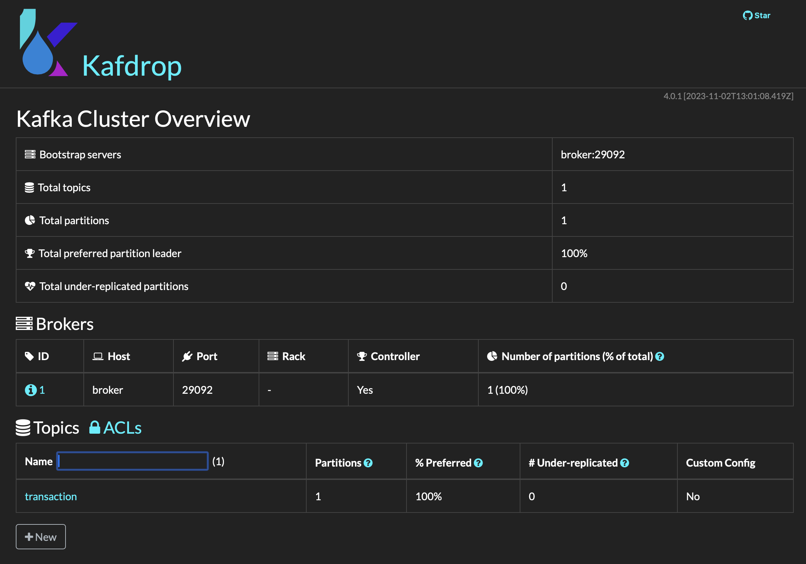

# node-js-kafka
This is a beginner friendly repository that demonstrates how to set up a kafka cluster, producers, and consumers using Node JS.

## 🧱 System Architecture


## 💡 General Idea
To start with kafka, you will need 3 entities to make the entire process work. A kafka server, an app running to produce data, and consumer runnig app. You will need to create a folder for each apps to in order to organize it and understand the system properly. Using a yaml file, you will create an instruction that will dockerize the kafka clunter and its components.

## 👣 Here are the steps to do that
1. **Set up zookeeper image** by creating the ```docker-compose.yml``` file first in a separate directory. In configuration below, I am using Confluent Inc. zookeeper image. You can choose any version you want. But in this repository, I will be sticking with version 7.3.0. I left everything default as it is. [This link](https://www.google.com/url?sa=t&rct=j&q=&esrc=s&source=web&cd=&ved=2ahUKEwiGyZGsp8WCAxXXbmwGHal1DQ8QFnoECB8QAQ&url=https%3A%2F%2Fmedium.com%2F%40logeesan%2Fzookeeper-in-kafka-ce31b3dd55b1&usg=AOvVaw0DcvpBJ2huhpu_ALBUyVuz&opi=89978449) tells what a zookeeper is.
```
services:
  zookeeper:
    image: confluentinc/cp-zookeeper:7.3.0
    container_name: zookeeper
    environment:
      ZOOKEEPER_CLIENT_PORT: 2181
      ZOOKEEPER_TICK_TIME: 2000
```
2. **Set up kafka image** below the zookeeper service configuration. I left everything default except adding the `KAFKA_CREATE_TOPICS: 'transaction:3:1'` under environment property in order to initialize a topic called transaction during the start up.

```
  broker:
    image: confluentinc/cp-kafka:7.3.0
    container_name: broker
    ports:
      - "9092:9092"
    depends_on:
      - zookeeper
    environment:
      KAFKA_BROKER_ID: 1
      KAFKA_ZOOKEEPER_CONNECT: 'zookeeper:2181'
      KAFKA_LISTENER_SECURITY_PROTOCOL_MAP: PLAINTEXT:PLAINTEXT,PLAINTEXT_INTERNAL:PLAINTEXT
      KAFKA_ADVERTISED_LISTENERS: PLAINTEXT://localhost:9092,PLAINTEXT_INTERNAL://broker:29092
      KAFKA_OFFSETS_TOPIC_REPLICATION_FACTOR: 1
      KAFKA_TRANSACTION_STATE_LOG_MIN_ISR: 1
      KAFKA_TRANSACTION_STATE_LOG_REPLICATION_FACTOR: 1
      KAFKA_CREATE_TOPICS: 'transaction:3:1'
```
3. **Setup Kafdrop** to allow localhost kafka management
```
  kafdrop:
    image: obsidiandynamics/kafdrop
    restart: 'no'
    ports:
      - '9000:9000'
    environment:
      KAFKA_BROKERCONNECT: 'broker:29092'
    depends_on:
      - broker
```

4. Use `docker-compose up -d` in your terminal to create docker image and run the container.
5. Run the consumer first, finally, the producer. Make sure to watch the terminal of consumer in order to see the incoming queue messages coming from the producer.

### 🕹️ Uses of Kafka in your project
1. Process payments and financial transactions in real-time, such as in stock exchanges, banks, and insurances.

2. Track and monitor cars, trucks, fleets, and shipments in real-time, such as in logistics and the automotive industry.

3. Continuously capture and analyze sensor data from IoT devices or other equipment, such as in factories and wind parks.

4. Collect and immediately react to customer interactions and orders, such as in retail, the hotel and travel industry, and mobile applications.

5. Monitor patients in hospital care and predict changes in condition to ensure timely treatment in emergencies.

6. Connect, store, and make available data produced by different divisions of a company.

7. Serve as the foundation for data platforms, event-driven architectures, and microservices.

